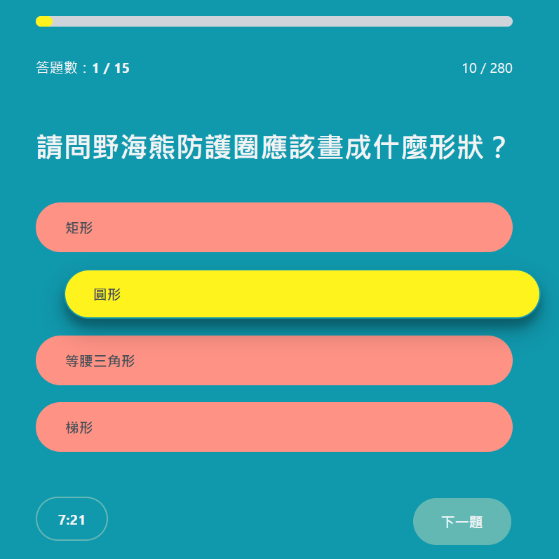
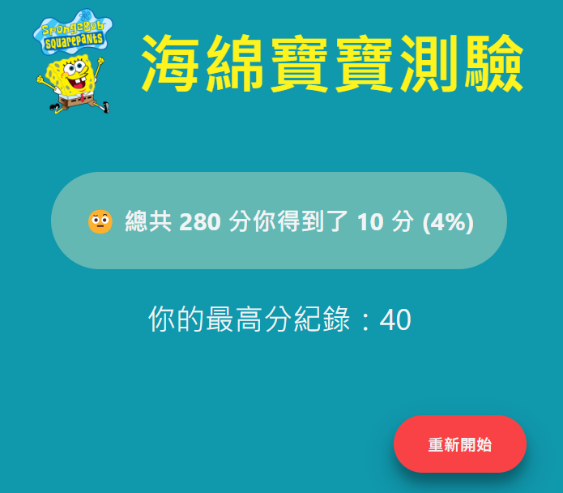

# 🧽 SpongeBob Quiz

## About the project

You think you are an expert on SpongeBob the Squarepants? Then come take the challenge to rock SpongeBob quiz! 15 selected quizzes to test your knowledge on our beloved episodes.

## Features

- Take the quiz and get immediate feedback for every questions ✅

- A timer to challenge your speed on answering questions ✅

- Browsers will remember your highest score records ✅

- Visualized progress bar ✅

## 👁️ Live demo

👉 https://vocal-speculoos-c6aed6.netlify.app

## 🧩 Built with

[](https://skillicons.dev)

## 🤓 What I have learned

- How to use json-server
- How to use useReducer in React
- How to use Netlify serverless functions

## ⭐ State management

In this project, I have tried to use `useReducer` to centralize state logic instead of scattering states logic throughout different components.

In addition, complex state transitions are mapped to actions, which provides a more declarative way to update states.

Through this project, I realised that `useReducer` is ideal for multiple related pieces of state.

## 🚀 Installation

1. Clone the project to your local environment

```bash
$ git clone "https://github.com/Xavier-Hsiao/quiz-spongebob.git"
```

2. Open the project and install all packages with the command below

```bash
$ npm install
```

3. Boost the service

```bash
$ npm run dev
```

4. Open your browser and navigate to the following path: `http://localhost:3000/`

## 👜 Packages

- react ^18.2.0
- react-dom ^18.2.0
- sass ^1.69.7
- vite ^5.0.8
- json-server ^1.0.0-alpha.22
- french-verbs-lefff ^3.3.0

## 📸 Screenshots

### Start Screen


### Active


### Finish Screen

